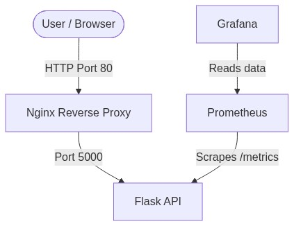

# SRE Intern Assessment

This is my code for the SRE / DevOps Intern technical assessment at Hiyaku Systems.

I set up a Python Flask REST API and wrapped it with Docker, Nginx, Prometheus, and Grafana to meet the requirements.

## Project Overview

- **REST API**: Built with Flask. Has endpoints for `/`, `/health`, and `/api/v1/items`. Added a `/metrics` route for monitoring.
- **Docker**: Wrote a `Dockerfile` for the app. Everything runs through `docker-compose`.
- **Nginx**: Acts as a reverse proxy on port 80 to forward traffic to the Flask app.
- **CI/CD**: Added a `Jenkinsfile` that checks out the code, installs dependencies, runs tests, builds the Docker image, and deploys it.
- **Monitoring**: Prometheus hits the `/metrics` endpoint every 5 seconds. Grafana reads from Prometheus for dashboards. Alerting rules are also set up.

## API Endpoints

You can hit the API through Nginx on `http://localhost` or directly locally on `http://localhost:5050`.

- `GET /` -> Simple status check
- `GET /health` -> Shows if the API is UP
- `GET /api/v1/items` -> List some dummy items
- `POST /api/v1/items` -> Add an item (needs JSON with a "name")
- `GET /metrics` -> Raw prometheus metrics data

Example of checking the health:
```bash
curl http://localhost/health
```

Example of getting items:
```bash
curl http://localhost/api/v1/items
```

## Architecture



### Containers
1. **nginx**: Reverse proxy listening on port 80.
2. **api**: The Python application itself.
3. **prometheus**: Handles scraping and evaluating alerts.
4. **grafana**: The UI for viewing the metrics.

## How to run it

You need Docker Desktop.

1. Clone this repo.
2. Open a terminal and run:
   ```bash
   docker compose up -d --build
   ```
3. That's it. You can check the services:
   - API: `http://localhost/`
   - Prometheus: `http://localhost:9090`
   - Grafana: `http://localhost:3000` (Login with `admin` / `admin`)

When you are done, clean up with:
```bash
docker compose down
```

## Running tests locally
If you just want to run the python code without Docker:
```bash
pip install -r requirements.txt
pytest tests/
python app/main.py
```
